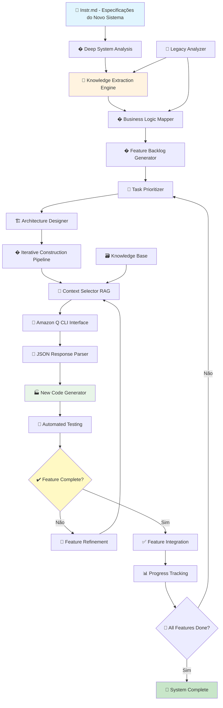
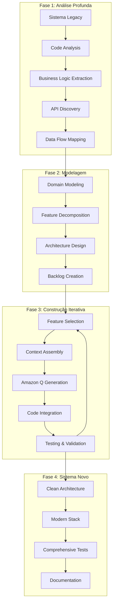
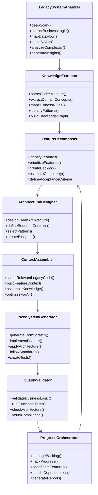
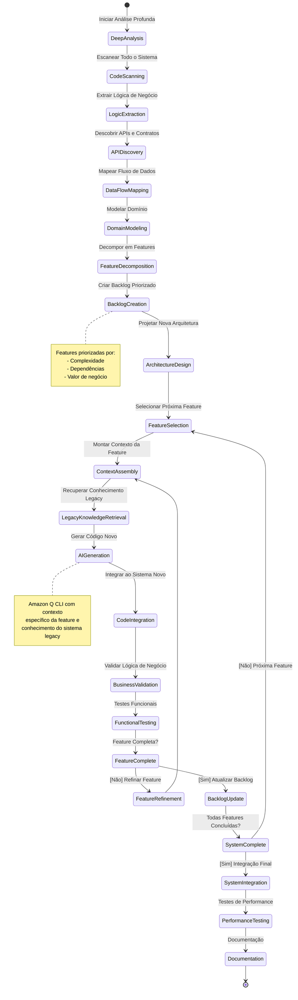
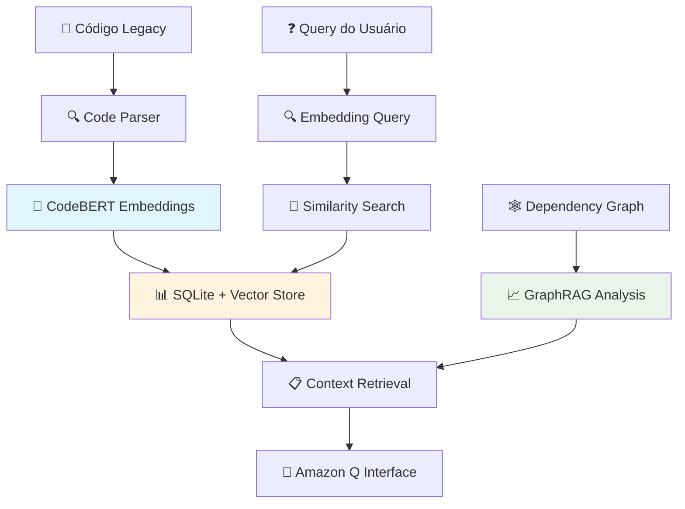
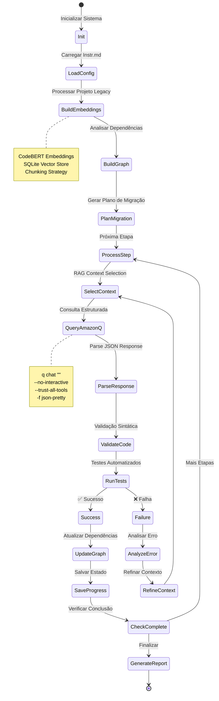

# Arquitetura do Agente de Reengenharia Java Legacy

## ❗ PARADIGMA FUNDAMENTAL: REENGENHARIA EM VEZ DE MIGRAÇÃO

**Problema identificado**: Sistemas legados são frequentemente inviáveis para migração direta devido a:
- God Classes e arquitetura monolítica
- Código espaguete e baixa coesão
- Dependências circulares e acoplamento forte
- Falta de testes e documentação

**Solução**: **Reengenharia Completa** - Entender profundamente o sistema legacy e reconstruir do zero seguindo as especificações do `Instr.md`.

## Diagrama Principal do Sistema de Reengenharia



## Diagrama de Fases da Reengenharia



## Estrutura de Componentes Reformulada



## Fluxo de Estados da Reengenharia



## Estrutura de Arquivos para Reengenharia

```mermaid
graph TD
    A[📁 java-reengineering-agent/] --> B[📄 Instr.md]
    A --> C[📁 src/]
    A --> D[📁 templates/]
    A --> E[📁 workspace/]
    A --> F[📁 output/]
    A --> G[📁 logs/]
    A --> H[📁 knowledge_base/]
    
    C --> C1[📁 analyzers/]
    C --> C2[📁 extractors/]
    C --> C3[📁 decomposers/]
    C --> C4[📁 designers/]
    C --> C5[📁 generators/]
    C --> C6[📁 validators/]
    C --> C7[📁 orchestrators/]
    C --> C8[📁 rag/]
    C --> C9[📁 utils/]
    
    C1 --> C1A[legacy_system_analyzer.py]
    C1 --> C1B[code_scanner.py]
    C1 --> C1C[complexity_analyzer.py]
    
    C2 --> C2A[business_logic_extractor.py]
    C2 --> C2B[api_discovery.py]
    C2 --> C2C[data_flow_mapper.py]
    C2 --> C2D[knowledge_extractor.py]
    
    C3 --> C3A[feature_decomposer.py]
    C3 --> C3B[backlog_generator.py]
    C3 --> C3C[dependency_analyzer.py]
    
    C4 --> C4A[architecture_designer.py]
    C4 --> C4B[pattern_selector.py]
    C4 --> C4C[blueprint_creator.py]
    
    C5 --> C5A[new_system_generator.py]
    C5 --> C5B[amazon_q_interface.py]
    C5 --> C5C[code_synthesizer.py]
    
    C6 --> C6A[business_validator.py]
    C6 --> C6B[functional_tester.py]
    C6 --> C6C[quality_checker.py]
    
    C7 --> C7A[progress_orchestrator.py]
    C7 --> C7B[feature_coordinator.py]
    C7 --> C7C[pipeline_manager.py]
    
    D --> D1[📁 java/]
    D --> D2[📁 spring-boot/]
    D --> D3[📁 maven/]
    D --> D4[📁 prompts/]
    
    D4 --> D4A[📁 analysis/]
    D4 --> D4B[📁 decomposition/]
    D4 --> D4C[📁 generation/]
    D4 --> D4D[📁 validation/]
    D4 --> D4E[📁 common/]
    
    D4A --> D4A1[system_analysis.md]
    D4A --> D4A2[business_logic_extraction.md]
    D4A --> D4A3[api_discovery.md]
    D4A --> D4A4[data_flow_mapping.md]
    
    D4B --> D4B1[feature_decomposition.md]
    D4B --> D4B2[backlog_creation.md]
    D4B --> D4B3[dependency_analysis.md]
    D4B --> D4B4[bounded_context_identification.md]
    
    D4C --> D4C1[code_generation.md]
    D4C --> D4C2[test_generation.md]
    D4C --> D4C3[architecture_implementation.md]
    D4C --> D4C4[feature_implementation.md]
    
    D4D --> D4D1[business_validation.md]
    D4D --> D4D2[functional_testing.md]
    D4D --> D4D3[quality_assessment.md]
    D4D --> D4D4[api_compatibility.md]
    
    D4E --> D4E1[base_prompt.md]
    D4E --> D4E2[response_format.md]
    D4E --> D4E3[context_template.md]
    D4E --> D4E4[instruction_guidelines.md]
    
    E --> E1[📁 legacy-system/]
    E --> E2[📁 new-system/]
    E --> E3[📁 analysis-results/]
    E --> E4[📁 feature-backlog/]
    
    H --> H1[📄 legacy_knowledge.db]
    H --> H2[📄 business_rules.json]
    H --> H3[📄 api_contracts.json]
    H --> H4[📄 domain_model.json]
    H --> H5[📄 feature_backlog.json]
    
    style C2 fill:#e1f5fe
    style C3 fill:#fff3e0
    style C5 fill:#e8f5e8
    style H fill:#f3e5f5
    style D4 fill:#fff9c4
```



### 7. **Estrutura de Prompts Organizados**

#### **Organização dos Prompts por Categoria:**

```yaml
# Estrutura de Templates de Prompts
templates/prompts/
├── analysis/           # Prompts para análise do sistema legacy
├── decomposition/      # Prompts para decomposição em features
├── generation/         # Prompts para geração de código novo
├── validation/         # Prompts para validação e testes
└── common/            # Prompts base e templates reutilizáveis
```

#### **📁 analysis/ - Prompts de Análise**

```markdown
# system_analysis.md
ROLE: Senior Software Architect specializing in legacy system analysis

TASK: Analyze the provided legacy Java system and extract comprehensive insights

INPUT_CONTEXT:
- Legacy system source code
- Configuration files
- Documentation (if available)
- Deployment scripts

OUTPUT_FORMAT: {
    "system_overview": {
        "language_version": "string",
        "frameworks": ["list"],
        "architecture_pattern": "string",
        "complexity_score": "number (1-10)"
    },
    "code_structure": {
        "total_classes": "number",
        "god_classes": ["list of classes with >500 LOC"],
        "circular_dependencies": ["list"],
        "design_patterns": ["detected patterns"]
    },
    "technical_debt": {
        "anti_patterns": ["list"],
        "code_smells": ["list"],
        "security_issues": ["list"]
    },
    "recommendations": ["prioritized list of issues to address"]
}

ANALYSIS_GUIDELINES:
1. Focus on business logic extraction
2. Identify clear architectural boundaries
3. Map data flow between components
4. Assess testability and maintainability
```

#### **📁 decomposition/ - Prompts de Decomposição**

```markdown
# feature_decomposition.md
ROLE: Domain-Driven Design Expert

TASK: Decompose the analyzed legacy system into independent, cohesive features

INPUT_CONTEXT:
- System analysis results
- Business domain knowledge
- User stories or requirements
- API contracts

OUTPUT_FORMAT: {
    "bounded_contexts": [
        {
            "name": "string",
            "description": "string",
            "entities": ["list"],
            "value_objects": ["list"],
            "aggregates": ["list"]
        }
    ],
    "features": [
        {
            "id": "string",
            "name": "string",
            "description": "string",
            "bounded_context": "string",
            "complexity": "low|medium|high",
            "business_value": "low|medium|high",
            "dependencies": ["list of feature IDs"],
            "acceptance_criteria": ["list"],
            "estimated_effort": "string"
        }
    ]
}

DECOMPOSITION_PRINCIPLES:
1. High cohesion within features
2. Low coupling between features
3. Clear business value
4. Independent deployability
5. Testable in isolation
```

#### **📁 generation/ - Prompts de Geração**

```markdown
# code_generation.md
ROLE: Senior Java Developer with expertise in Spring Boot and Clean Architecture

TASK: Generate modern, clean Java code implementing the specified feature

INPUT_CONTEXT:
- Feature specification
- Legacy implementation reference
- Business rules to preserve
- Architecture constraints
- API contracts to maintain

TARGET_ARCHITECTURE:
- Java 17
- Spring Boot 3.2.0
- Clean Architecture (Hexagonal)
- Domain-Driven Design
- Test-Driven Development

OUTPUT_FORMAT: {
    "files": [
        {
            "path": "relative/path/to/file.java",
            "content": "complete file content",
            "purpose": "description",
            "layer": "domain|application|infrastructure|presentation"
        }
    ],
    "tests": [
        {
            "path": "relative/path/to/test.java",
            "content": "complete test content",
            "type": "unit|integration|acceptance"
        }
    ],
    "configuration": {
        "dependencies": ["list of new Maven dependencies"],
        "properties": {"key": "value pairs for application.yml"}
    },
    "documentation": {
        "readme": "feature documentation",
        "api_docs": "endpoint documentation if applicable"
    }
}

QUALITY_REQUIREMENTS:
- Test coverage > 90%
- Cyclomatic complexity < 10
- No code duplication
- SOLID principles
- Dependency injection
- Exception handling
- Input validation
- Logging and monitoring
```

#### **📁 validation/ - Prompts de Validação**

```markdown
# business_validation.md
ROLE: Business Analyst and QA Engineer

TASK: Validate that the reengineered feature preserves all business logic

INPUT_CONTEXT:
- Original legacy feature behavior
- New implementation
- Business rules documentation
- Test scenarios

OUTPUT_FORMAT: {
    "validation_results": {
        "business_logic_preserved": "boolean",
        "api_compatibility": "boolean",
        "data_integrity": "boolean",
        "performance_acceptable": "boolean"
    },
    "test_scenarios": [
        {
            "scenario": "description",
            "input": "test data",
            "expected_output": "expected result",
            "actual_output": "actual result",
            "status": "pass|fail",
            "notes": "observations"
        }
    ],
    "discrepancies": [
        {
            "type": "business_logic|api|data|performance",
            "description": "what differs",
            "impact": "low|medium|high",
            "recommendation": "how to fix"
        }
    ]
}

VALIDATION_CRITERIA:
1. All business rules must be preserved
2. API contracts must be maintained
3. Data transformations must be equivalent
4. Performance must be equal or better
5. Error handling must be consistent
```

#### **📁 common/ - Templates Base**

```markdown
# base_prompt.md
SYSTEM_ROLE: Expert Java Software Engineer with 15+ years experience in legacy system modernization

CORE_PRINCIPLES:
1. Preserve all business logic exactly
2. Never modify legacy code - always create new
3. Follow modern architectural patterns
4. Ensure comprehensive test coverage
5. Maintain API compatibility when required
6. Document all architectural decisions

RESPONSE_REQUIREMENTS:
- Always respond in valid JSON format
- Include complete file contents, not snippets
- Provide clear explanations for decisions
- Highlight any assumptions made
- Suggest next steps or dependencies

ERROR_HANDLING:
- If requirements are unclear, ask for clarification
- If conflicts arise, prioritize business logic preservation
- If constraints cannot be met, explain alternatives
```

### 8. **Sistema de Prompt Management**

```python
class PromptManager:
    def __init__(self, prompts_base_path: str):
        self.prompts_path = prompts_base_path
        self.prompt_cache = {}
        
    def load_prompt(self, category: str, prompt_name: str) -> str:
        """Carrega prompt específico de arquivo"""
        prompt_path = f"{self.prompts_path}/{category}/{prompt_name}.md"
        
        if prompt_path not in self.prompt_cache:
            with open(prompt_path, 'r', encoding='utf-8') as f:
                self.prompt_cache[prompt_path] = f.read()
                
        return self.prompt_cache[prompt_path]
    
    def build_contextualized_prompt(self, 
                                   base_prompt: str, 
                                   context: dict, 
                                   variables: dict = None) -> str:
        """Constrói prompt contextualizado com variáveis"""
        
        # Substitui variáveis no template
        if variables:
            for key, value in variables.items():
                base_prompt = base_prompt.replace(f"{{{key}}}", str(value))
        
        # Adiciona contexto específico
        contextualized = f"""
{base_prompt}

SPECIFIC_CONTEXT:
{json.dumps(context, indent=2)}

BEGIN_ANALYSIS:
"""
        return contextualized
    
    def get_prompt_for_phase(self, phase: str, task: str) -> str:
        """Retorna prompt apropriado para fase específica"""
        prompt_map = {
            "analysis": {
                "system": "analysis/system_analysis.md",
                "business_logic": "analysis/business_logic_extraction.md",
                "api": "analysis/api_discovery.md"
            },
            "decomposition": {
                "features": "decomposition/feature_decomposition.md",
                "backlog": "decomposition/backlog_creation.md"
            },
            "generation": {
                "code": "generation/code_generation.md",
                "tests": "generation/test_generation.md"
            },
            "validation": {
                "business": "validation/business_validation.md",
                "quality": "validation/quality_assessment.md"
            }
        }
        
        prompt_file = prompt_map.get(phase, {}).get(task)
        if not prompt_file:
            raise ValueError(f"No prompt found for phase: {phase}, task: {task}")
            
        return self.load_prompt(phase, task)
```

### 9. **Versionamento e Evolução de Prompts**

```yaml
# Estratégia de versionamento dos prompts
prompt_versioning:
  strategy: "git-based"
  
  structure:
    - v1.0/  # Versão base
    - v1.1/  # Melhorias incrementais
    - experimental/  # Prompts em teste
    
  testing:
    - A/B testing com prompts diferentes
    - Métricas de qualidade de resposta
    - Feedback loop para melhorias
    
  documentation:
    - Changelog para cada versão
    - Exemplos de uso
    - Métricas de performance
```

```yaml
# Configuração para Reengenharia de Sistema Legacy
reengineering_config:
  # Sistema Legacy
  legacy_system:
    path: "/path/to/legacy/system"
    language: "java"
    version: "8"
    framework: "struts" # ou qualquer framework antigo
    
  # Sistema Novo (Target)
  target_system:
    java_version: "17"
    framework: "spring-boot"
    version: "3.2.0"
    build_tool: "maven"
    architecture: "clean-architecture"
    patterns: ["domain-driven-design", "cqrs", "event-sourcing"]
    testing: ["junit5", "testcontainers", "mockito"]
    
  # Estratégia de Reengenharia
  reengineering_strategy:
    approach: "ground-up-rebuild"  # ground-up-rebuild | hybrid
    analysis_depth: "deep"         # surface | medium | deep
    feature_prioritization: "business-value" # complexity | dependencies | business-value
    
  # Análise do Sistema Legacy
  analysis_config:
    extract_business_rules: true
    map_data_flows: true
    identify_apis: true
    analyze_god_classes: true
    detect_anti_patterns: true
    
  # Knowledge Base
  knowledge_extraction:
    embedding_model: "microsoft/codebert-base"
    chunk_size: 1024
    overlap: 100
    include_comments: true
    include_tests: true
    
  # Feature Decomposition
  feature_management:
    max_feature_complexity: "medium"
    min_feature_value: "high"
    dependency_handling: "smart"  # ignore | smart | strict
    
  # Quality Standards
  quality_requirements:
    test_coverage: 90
    cyclomatic_complexity: 10
    code_duplication: 3
    maintainability_index: 85
    
  # Business Rules Preservation
  business_constraints:
    - "preserve_all_business_logic"
    - "maintain_data_integrity"
    - "ensure_api_compatibility"
    - "keep_performance_characteristics"
    
  # Exclusions from Analysis
  exclusions:
    - "*/test/*"
    - "*/target/*"
    - "*/build/*"
    - "*.class"
    - "*/lib/*"
    - "*/vendor/*"
```

### 10. **Configuração do Arquivo Instr.md para Reengenharia**

#### Deep System Analysis:
```python
class DeepSystemAnalyzer:
    def analyze_legacy_system(self, system_path: str) -> SystemKnowledge:
        """Análise profunda multi-dimensional do sistema legacy"""
        
        # 1. Análise estrutural
        structure = self.analyze_code_structure(system_path)
        
        # 2. Extração de lógica de negócio  
        business_logic = self.extract_business_logic(structure)
        
        # 3. Mapeamento de APIs
        apis = self.discover_apis(structure)
        
        # 4. Análise de fluxo de dados
        data_flows = self.map_data_flows(structure)
        
        # 5. Identificação de god classes
        god_classes = self.identify_god_classes(structure)
        
        # 6. Detecção de anti-patterns
        anti_patterns = self.detect_anti_patterns(structure)
        
        return SystemKnowledge(
            structure=structure,
            business_logic=business_logic,
            apis=apis,
            data_flows=data_flows,
            problems=god_classes + anti_patterns
        )
```

#### Feature Decomposition Algorithm:
```python
class IntelligentFeatureDecomposer:
    def decompose_system(self, knowledge: SystemKnowledge) -> FeatureBacklog:
        """Decompõe sistema em features independentes"""
        
        # 1. Identificar bounded contexts
        contexts = self.identify_bounded_contexts(knowledge.business_logic)
        
        # 2. Extrair features por contexto
        raw_features = []
        for context in contexts:
            features = self.extract_features_from_context(context)
            raw_features.extend(features)
        
        # 3. Analisar dependências entre features
        dependencies = self.analyze_feature_dependencies(raw_features)
        
        # 4. Priorizar features
        prioritized = self.prioritize_features(raw_features, dependencies)
        
        # 5. Criar acceptance criteria
        backlog = []
        for feature in prioritized:
            criteria = self.generate_acceptance_criteria(feature, knowledge)
            backlog.append(FeatureTask(feature, criteria))
            
        return FeatureBacklog(backlog)
```

### 9. **Context Assembly para Reengenharia**

```python
class ReengineeringContextAssembler:
    def assemble_feature_context(self, feature: Feature, knowledge_base: KnowledgeBase) -> dict:
        """Monta contexto específico para reengenharia de uma feature"""
        
        context = {
            "feature_specification": feature.specification,
            "business_rules": self.extract_relevant_business_rules(feature, knowledge_base),
            "legacy_implementations": self.find_legacy_implementations(feature, knowledge_base),
            "data_models": self.extract_data_models(feature, knowledge_base),
            "api_contracts": self.extract_api_contracts(feature, knowledge_base),
            "test_scenarios": self.generate_test_scenarios(feature, knowledge_base),
            "architecture_constraints": self.get_architecture_constraints(feature),
            "quality_requirements": self.get_quality_requirements(feature)
        }
        
        return self.optimize_context_for_ai(context)
        
    def build_amazon_q_prompt(self, feature: Feature, context: dict) -> str:
        """Constrói prompt específico para reengenharia"""
        return f"""
        TASK: Reengineer the following feature from legacy Java system to modern Spring Boot
        
        FEATURE: {feature.name}
        DESCRIPTION: {feature.description}
        
        LEGACY_CONTEXT:
        {json.dumps(context['legacy_implementations'], indent=2)}
        
        BUSINESS_RULES:
        {json.dumps(context['business_rules'], indent=2)}
        
        TARGET_ARCHITECTURE:
        - Spring Boot 3.2.0
        - Clean Architecture
        - Domain-Driven Design
        - Test-Driven Development
        
        API_CONTRACTS_TO_PRESERVE:
        {json.dumps(context['api_contracts'], indent=2)}
        
        QUALITY_REQUIREMENTS:
        - Test Coverage: 90%+
        - No God Classes
        - Single Responsibility Principle
        - Dependency Injection
        
        EXPECTED_OUTPUT: {{
            "status": "success|error",
            "files": [{{
                "path": "relative/path/to/file",
                "content": "complete_file_content",
                "purpose": "description of file purpose",
                "tests": "corresponding_test_file_content"
            }}],
            "architecture_notes": "explanation of architectural decisions",
            "business_logic_preserved": "confirmation of business rules preservation",
            "api_compatibility": "assessment of API compatibility",
            "next_dependencies": ["list of features this depends on"],
            "integration_points": ["how this integrates with other features"]
        }}
        
        IMPORTANT: Create completely new, clean code. Do not try to modify legacy code.
        """
```

### 10. **Sistema de Validação de Reengenharia**

```python
class ReengineeringValidator:
    def validate_reengineered_feature(self, 
                                     original_feature: LegacyFeature,
                                     new_feature: ModernFeature) -> ValidationResult:
        """Valida se a reengenharia preservou funcionalidade"""
        
        results = ValidationResult()
        
        # 1. Validação de lógica de negócio
        business_logic_preserved = self.validate_business_logic(
            original_feature.business_rules,
            new_feature.implementation
        )
        results.add_check("business_logic", business_logic_preserved)
        
        # 2. Validação de contratos de API
        api_compatibility = self.validate_api_compatibility(
            original_feature.apis,
            new_feature.apis
        )
        results.add_check("api_compatibility", api_compatibility)
        
        # 3. Validação de comportamento (testes funcionais)
        behavioral_compatibility = self.run_behavioral_tests(
            original_feature.test_scenarios,
            new_feature.implementation
        )
        results.add_check("behavior", behavioral_compatibility)
        
        # 4. Validação de qualidade de código
        code_quality = self.assess_code_quality(new_feature.implementation)
        results.add_check("quality", code_quality)
        
        return results
```

### 11. **Estimativas de Performance para Reengenharia**

#### Métricas Realistas:
- **Deep System Analysis**: ~2-5 horas para sistema médio (100k LOC)
- **Feature Decomposition**: ~30-60 minutos por bounded context
- **Context Assembly**: ~30 segundos por feature
- **AI Generation per Feature**: ~1-3 minutos (dependendo da complexidade)
- **Validation per Feature**: ~2-5 minutos

#### Escalabilidade:
- **Sistema Pequeno** (10k LOC): ~1-2 dias
- **Sistema Médio** (100k LOC): ~1-2 semanas  
- **Sistema Grande** (1M LOC): ~1-2 meses

#### Paralelização:
- Análise inicial: sequencial
- Feature generation: altamente paralela
- Validação: paralela por feature independente

### 10. **Pontos Críticos de Validação Técnica**

## Especificações Técnicas Detalhadas

### 1. **Interface Amazon Q CLI**

#### Comandos Principais:
```bash
# Chat interativo com JSON estruturado
q chat "<prompt>" --no-interactive --trust-all-tools -f json

# Configuração de formato de saída
q settings format json-pretty

# Verificação de status
q doctor
```

#### Estrutura de Comunicação:
```python
class AmazonQInterface:
    def __init__(self):
        self.base_command = "q chat"
        self.flags = "--no-interactive --trust-all-tools -f json-pretty"
    
    def build_prompt(self, context: dict, task: str) -> str:
        """Constrói prompt estruturado para garantir resposta JSON"""
        return f"""
        CONTEXT: {json.dumps(context)}
        TASK: {task}
        
        RESPONSE_FORMAT: {{
            "status": "success|error",
            "files": [{{
                "path": "relative/path/to/file",
                "content": "file_content",
                "changes": ["list of changes made"]
            }}],
            "dependencies": ["list of new dependencies"],
            "next_steps": ["suggested next actions"],
            "warnings": ["potential issues"]
        }}
        """
```

### 2. **Arquitetura RAG/GraphRAG para Análise de Contexto**

#### Stack Tecnológico:
- **Embeddings**: Microsoft CodeBERT (`microsoft/codebert-base`)
- **Banco de Dados**: SQLite com extensões para busca vetorial
- **Graph Database**: NetworkX para análise de dependências
- **Vector Search**: FAISS ou ChromaDB integrado

#### Componentes do Sistema RAG:



#### Schema do Banco SQLite:

```sql
-- Tabela principal de arquivos
CREATE TABLE files (
    id INTEGER PRIMARY KEY,
    path TEXT UNIQUE,
    content TEXT,
    hash TEXT,
    last_modified TIMESTAMP,
    file_type TEXT,
    complexity_score REAL
);

-- Tabela de embeddings
CREATE TABLE embeddings (
    id INTEGER PRIMARY KEY,
    file_id INTEGER,
    chunk_id INTEGER,
    embedding BLOB,  -- Vector binário do CodeBERT
    chunk_content TEXT,
    start_line INTEGER,
    end_line INTEGER,
    FOREIGN KEY (file_id) REFERENCES files(id)
);

-- Tabela de dependências (GraphRAG)
CREATE TABLE dependencies (
    id INTEGER PRIMARY KEY,
    source_file_id INTEGER,
    target_file_id INTEGER,
    dependency_type TEXT,  -- import, inheritance, composition, etc.
    strength REAL,  -- peso da dependência
    FOREIGN KEY (source_file_id) REFERENCES files(id),
    FOREIGN KEY (target_file_id) REFERENCES files(id)
);

-- Tabela de contextos otimizados
CREATE TABLE contexts (
    id INTEGER PRIMARY KEY,
    query_hash TEXT,
    context_files TEXT,  -- JSON array de file_ids
    relevance_score REAL,
    created_at TIMESTAMP
);
```

### 3. **Algoritmo de Seleção de Contexto Inteligente**

```python
class IntelligentContextSelector:
    def __init__(self):
        self.codebert_model = "microsoft/codebert-base"
        self.max_context_tokens = 80000  # Limite do Amazon Q
        self.db = SQLiteVectorDB()
        self.graph = DependencyGraph()
    
    def select_context(self, query: str, max_files: int = 10) -> dict:
        """Algoritmo híbrido RAG + GraphRAG"""
        
        # 1. Embedding Similarity Search
        query_embedding = self.encode_query(query)
        similar_chunks = self.db.similarity_search(query_embedding, top_k=20)
        
        # 2. Graph-based expansion
        relevant_files = set()
        for chunk in similar_chunks:
            file_id = chunk['file_id']
            # Adicionar dependências transitivas
            dependencies = self.graph.get_dependencies(file_id, depth=2)
            relevant_files.update([file_id] + dependencies)
        
        # 3. Ranking inteligente
        ranked_files = self.rank_files_by_relevance(
            relevant_files, query, similar_chunks
        )
        
        # 4. Otimização por tokens
        selected_files = self.optimize_token_usage(
            ranked_files[:max_files], self.max_context_tokens
        )
        
        return {
            "files": selected_files,
            "total_tokens": self.estimate_tokens(selected_files),
            "relevance_scores": self.get_relevance_scores(selected_files)
        }
```

### 4. **Pipeline de Processamento Incremental**

#### Estados Detalhados com Métricas:



### 5. **Sistema de Cache e Otimização**

```python
class CacheManager:
    def __init__(self):
        self.context_cache = {}  # Cache de contextos por query
        self.response_cache = {}  # Cache de respostas do Amazon Q
        self.embedding_cache = {}  # Cache de embeddings
    
    def get_cached_context(self, query_hash: str) -> Optional[dict]:
        """Recupera contexto em cache se disponível"""
        return self.db.get_cached_context(query_hash)
    
    def cache_amazon_q_response(self, query_hash: str, response: dict):
        """Cache respostas para evitar chamadas duplicadas"""
        self.db.save_response_cache(query_hash, response)
    
    def invalidate_cache_for_file(self, file_path: str):
        """Invalida cache quando arquivo é modificado"""
        self.db.invalidate_file_cache(file_path)
```

### 6. **Métricas e Monitoramento**

```python
class MetricsCollector:
    def __init__(self):
        self.metrics = {
            "queries_to_amazon_q": 0,
            "context_selection_time": [],
            "files_processed": 0,
            "successful_generations": 0,
            "failed_generations": 0,
            "cache_hit_rate": 0.0
        }
    
    def track_context_selection(self, duration: float, relevance: float):
        """Monitora eficiência da seleção de contexto"""
        self.metrics["context_selection_time"].append(duration)
    
    def generate_report(self) -> dict:
        """Gera relatório de performance"""
        return {
            "efficiency": self.calculate_efficiency(),
            "accuracy": self.calculate_accuracy(),
            "resource_usage": self.get_resource_usage()
        }
```

## Pontos Críticos de Validação

### 12. **Pontos Críticos de Validação para Reengenharia**

#### Análise de Sistema Legacy:
- ✅ Capacidade de identificar god classes e anti-patterns
- ✅ Extração completa de regras de negócio
- ✅ Mapeamento de APIs e contratos existentes
- ✅ Análise de fluxo de dados end-to-end

#### Decomposição Inteligente:
- ✅ Identificação correta de bounded contexts
- ✅ Features independentes e coesas
- ✅ Priorização baseada em valor e dependências
- ✅ Acceptance criteria completos e testáveis

#### Geração de Código Novo:
- ✅ Código limpo seguindo princípios SOLID
- ✅ Arquitetura moderna (Clean Architecture, DDD)
- ✅ Preservação de toda lógica de negócio
- ✅ Compatibilidade de APIs quando necessário

#### Validação de Reengenharia:
- ✅ Testes funcionais automáticos
- ✅ Verificação de contratos de API
- ✅ Análise de qualidade de código
- ✅ Performance equivalente ou melhor

## Questões para Validação da Abordagem de Reengenharia

### **Estratégia Fundamental:**
1. ✅ A mudança de "migração" para "reengenharia" resolve o problema das god classes?
2. ✅ A análise profunda captura suficientemente a lógica de negócio?
3. ✅ A decomposição em features é viável para sistemas complexos?
4. ✅ O approach "ground-up rebuild" é mais seguro que tentar migrar código ruim?

### **Implementação Técnica:**
5. ✅ O sistema de knowledge extraction é robusto o suficiente?
6. ✅ A validação garante preservação completa da funcionalidade?
7. ✅ O contexto para Amazon Q é específico e detalhado o suficiente?
8. ✅ As estimativas de tempo são realistas para sistemas grandes?

### **Riscos e Mitigações:**
9. ✅ Como garantir que nenhuma regra de negócio seja perdida?
10. ✅ Como lidar com dependências entre features durante a construção?
11. ✅ Como validar que o novo sistema tem comportamento idêntico?
12. ✅ Como gerenciar a transição do sistema antigo para o novo?

### **Próximos Passos da Reengenharia:**
- 🔄 Implementar analisador profundo de sistemas legacy
- 🔄 Criar decomposer inteligente de features
- 🔄 Desenvolver sistema de validação comportamental
- 🔄 Testar com sistema legacy real pequeno

---

**� Aguardando validação da nova abordagem de REENGENHARIA para proceder com implementação!**
